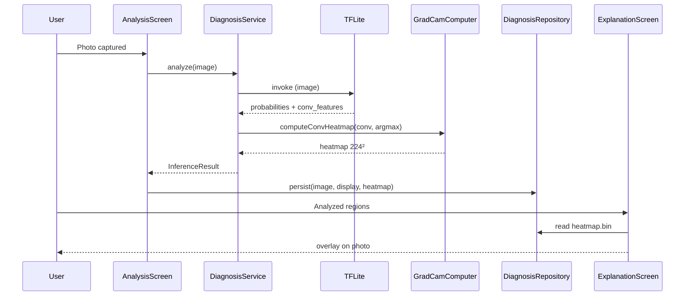

# Grad-CAM in AgroScan — technical documentation

This document describes the **Grad-CAM** visual explanation integrated into the AgroScan mobile app: goals, architecture, design choices, data flow, limitations, and improvement ideas.

**Audience:** project developers, milestone review, future maintenance.

---

## 1. Context and goals

### 1.1 Product need

Users should understand **why** the model produced a diagnosis (PlantVillage class + confidence). The **“Analyzed regions”** screen (`ExplanationScreen`) overlays an attention map on the leaf photo.

### 1.2 State before mobile integration

| Component | State |
|-----------|--------|
| Notebooks (`jalon2_pipeline_baseline.ipynb`, etc.) | Full Grad-CAM with Keras `GradientTape` |
| TFLite export (`export_mobile_tflite.py`) | Classification only: `[1, 38]` output |
| Mobile app (`ExplanationService`) | **Placeholder**: spots from image luminance, not model-driven |

### 1.3 Chosen goal

- **Single TFLite inference** per analysis.
- Outputs: **probabilities** (38 classes) + **attention map** for the **predicted class** (argmax).
- **Fully offline**, compatible with `tflite_flutter` (no `READ_VARIABLE` / unsupported Flex ops).

---

## 2. Grad-CAM recap (research side)

### 2.1 Principle

Grad-CAM (Gradient-weighted Class Activation Mapping) builds a heatmap by combining:

1. **Activations** from a deep conv layer (here the backbone’s last conv: `conv_1`, tensor **7×7×576**).
2. **Weights** from gradients of the target class score w.r.t. those activations.

Simplified formula:

```text
α_k = GlobalAveragePool( ∂y^c / ∂A^k )
L^c = ReLU( Σ_k α_k · A^k )
```

where `y^c` is the score for class `c`, `A^k` is feature map `k`.

### 2.2 Reference implementation (notebooks)

In `notebooks/jalon2_pipeline_baseline.ipynb`:

- Backbone: **MobileNetV3Small** (`include_preprocessing=True`).
- Head: `GlobalAveragePooling2D` → `Dropout` → `Dense(38, softmax)`.
- Target layer: **`conv_1`** (last backbone `Conv2D`).
- Computation via `tf.GradientTape` + `jet` overlay on 224×224.

`jalon2_next_experiments.ipynb` adds audits (leaf vs. background attention, etc.).

---

## 3. Key constraint: TensorFlow Lite on mobile

### 3.1 What `tflite_flutter` supports

- **Forward pass only:** `setInput` → `invoke` → read outputs.
- No `GradientTape`, no on-device backprop.

### 3.2 Rejected approach: Grad-CAM inside the TFLite graph

An early export (`GradCamExplainLayer` with embedded `GradientTape`) failed TFLite conversion — gradient ops (`StridedSliceGrad`, `Relu6Grad`, etc.) → `ERROR_NEEDS_FLEX_OPS`, incompatible with the current mobile stack (same guard as `READ_VARIABLE` in `export_mobile_tflite.py`).

### 3.3 Chosen strategy: split export + Dart computation

```text
┌─────────────────────────────────────────────────────────────┐
│  TFLite (single invoke)                                      │
│  Input: image [1, 224, 224, 3] float32, pixels [0, 255]    │
│  Output A: probabilities [1, 38]                           │
│  Output B: conv_features [1, 7, 7, 576]  (conv_1)          │
└─────────────────────────────────────────────────────────────┘
                              │
                              ▼
┌─────────────────────────────────────────────────────────────┐
│  Assets: gradcam_classifier_weights.bin (576 × 38 floats)    │
│  Grad-CAM in Dart for argmax class                           │
│  → 7×7 map → bilinear upsample → 224×224                     │
└─────────────────────────────────────────────────────────────┘
```

Dart uses the exported **Dense kernel** weights. For **GAP + Dense** at **inference** (dropout off), this matches **Class Activation Mapping (CAM)**: channel importance is the classifier column for class `c`. Standard approximation when gradients cannot run on device.

**Minor theory gap vs. notebook:** training Grad-CAM uses real gradients; at inference with a near-linear head after GAP, CAM and Grad-CAM are very close. For reports, cite Selvaraju et al. (Grad-CAM) and note the mobile **forward CAM on `conv_1`**.

---

## 4. Model architecture

### 4.1 Keras graph (baseline)

```text
Input (224×224×3, [0,255])
    → MobileNetV3Small
        → conv_1 : [7, 7, 576]   ← explanation layer
        → …
        → backbone output [7, 7, 576]
    → GlobalAveragePooling2D
    → Dropout (off at inference)
    → Dense(38, softmax)
```

### 4.2 Dual-output TFLite (export)

Script: **`scripts/export_mobile_explain_tflite.py`**

- Rebuilds a functional model with a single `image` input.
- Two branches on the same backbone (shared weights; two internal forwards in the exported graph):
  - `conv_features` = `conv_1` output.
  - `probabilities` = softmax after GAP/Dropout/Dense.
- TFLite conversion **without quantization** (float32, ~3.7 MB).
- Verification: no `READ_VARIABLE` / `VAR_HANDLE` ops.

**Files under `mobile/assets/models/`:**

| File | Role |
|------|------|
| `agroscan_baseline_float.tflite` | Dual model (replaces classification-only export) |
| `gradcam_classifier_weights.bin` | Dense kernel `(576, 38)` float32 |
| `gradcam_classifier_weights.json` | Metadata (`channels`, `classes`, `spatial`) |
| `labels.json` | 38 PlantVillage labels |

Sync: **`./scripts/sync_mobile_assets.sh`** (explain export + optional quantized export).

### 4.3 Preprocessing (unchanged)

Same as classification (`mobile/lib/data/ml/preprocess.dart`):

- Resize **224×224**, linear interpolation.
- NHWC, **float32**, RGB in **[0, 255]** (MobileNet rescaling is **inside** TFLite).

---

## 5. On-device Grad-CAM computation

### 5.1 `GradCamComputer` module

File: **`mobile/lib/data/ml/grad_cam.dart`**

1. Loads `gradcam_classifier_weights.bin` on first use.
2. `computeConvHeatmap(convFeatures, classIndex)`:
   - Per spatial cell `(i, j)`:
     - `sum_k = Σ_k A[i,j,k] · W[k, classIndex]`
     - `ReLU(sum)` then global max normalization → **[0, 1]** on **7×7**.
3. `upsample(...)`: **bilinear** interpolation to **224×224**.

Heatmap uses **`classIndex` = argmax** of probabilities (class shown on the result screen).

### 5.2 Integration in `DiagnosisService`

File: **`mobile/lib/data/ml/diagnosis_service.dart`**

```text
buildModelInput(image)
    → interpreter.invoke()
    → detect output tensors by shape ([1,38] vs [1,7,7,576])
    → argmax + LabelMapper
    → GradCamComputer → 224×224 heatmap
    → InferenceResult(display, topLabels, heatmap, durationMs)
```

### 5.3 Persistence

File: **`mobile/lib/data/local/diagnosis_repository.dart`**

- On `persistDiagnosis` / `replaceDiagnosis`, heatmap written as binary:
  - Path: `{diagnostics_dir}/{id}_heatmap.bin`
  - Fixed size: `224 × 224 × 4` bytes (float32).
- Heatmap file deleted in `deleteById`.
- Diagnostics **created before** this feature have no heatmap → empty overlay on the explanation screen.

### 5.4 UI display

File: **`mobile/lib/data/explanation/explanation_service.dart`**

- Reads `{id}_heatmap.bin` (224×224 float grid).

File: **`mobile/lib/shared/widgets/heatmap_overlay.dart`**

- Converts grid to RGBA (yellow → orange → red, alpha by intensity).
- Draws with `BoxFit.cover` over the photo (continuous overlay).

Screen: **`mobile/lib/features/explanation/explanation_screen.dart`**

- Copy explains colored regions vs. model attention (French UI strings).

---

## 6. End-to-end user flow



---

## 7. Design choices

| Choice | Rejected alternatives | Rationale |
|--------|----------------------|-----------|
| **Single TFLite invoke** | Two models (classifier + backbone only) | Lower latency, simpler; cost: heavier graph (~dual backbone read in export). |
| **Grad-CAM in Dart** | Grad-CAM in TFLite / server | Only option compatible with mobile ops; Dense weights are small (~88 KB). |
| **Class = argmax** | User-picked class heatmap | Matches displayed diagnosis; one heatmap to store. |
| **`conv_1` layer** | Other layers | Matches notebooks; 7×7 enough for whole leaf. |
| **`.bin` file storage** | SQLite BLOB column | No DB migration; file removed with diagnosis. |
| **Continuous 224×224 overlay** | Discrete 7×7 spots | Smoother colormap (`HeatmapOverlay`). |
| **Float32, not quantized** | Quantized dual model | Quantized conv features would hurt the map; size acceptable. |

---

## 8. Known limitations

1. **CAM / inference Grad-CAM approximation** — no `GradientTape` on phone; gap grows if the head becomes strongly non-linear.
2. **7×7 spatial resolution** — coarse regions; 224×224 upsampling smooths but does not add fine detail.
3. **Single explained class** — no heatmap for 2nd/3rd top-3 choices.
4. **Historical diagnostics** — no retroactive heatmap without re-analysis.
5. **Compute cost** — dual export runs two backbone forwards internally (perf/battery vs. old model).
6. **No automated mobile regression** — no unit test comparing Dart vs. notebook on a fixed image (recommended follow-up).

---

## 9. Possible improvements

### 9.1 Short term

- **Regression test:** Python script exports `conv_features` + probs for a fixed image; Dart test compares heatmap to numpy reference (float tolerance).
- Document asset sizes in `mobile/README.md` (done in part).

### 9.2 Medium term

- **Heatmap for all top-3 classes:** cheap Dart recomputation (same `conv_features`, three weight columns); UI selector.
- **Re-analyze from history:** “Generate explanation” when `*_heatmap.bin` is missing.
- **Export optimization:** single backbone pass, two heads (if TFLite conversion allows).

### 9.3 Long term

- **Grad-CAM in TFLite** if Flex / gradient ops become viable on Flutter.
- **Improved model** (`jalon2_pipeline_improved`): re-export dual + validate on PlantDoc.
- **Score-CAM / Grad-CAM++** to reduce background attention (see `jalon2_next_experiments.ipynb`).
- **Leaf segmentation** before heatmap to mask soil/pot.

---

## 10. Repository file reference

### Python / export

| Path | Description |
|------|-------------|
| `scripts/export_mobile_explain_tflite.py` | Dual model + Grad-CAM weights export |
| `scripts/export_mobile_tflite.py` | Classification-only / quantized export (optional) |
| `scripts/sync_mobile_assets.sh` | Mobile asset pipeline |
| `notebooks/jalon2_pipeline_baseline.ipynb` | Reference Grad-CAM |
| `notebooks/jalon2_next_experiments.ipynb` | Grad-CAM audit on PlantDoc |

### Flutter

| Path | Description |
|------|-------------|
| `mobile/lib/data/ml/diagnosis_service.dart` | Dual inference orchestration |
| `mobile/lib/data/ml/grad_cam.dart` | Map computation + heatmap I/O |
| `mobile/lib/data/ml/preprocess.dart` | Image preprocessing |
| `mobile/lib/data/explanation/explanation_service.dart` | Heatmap loading |
| `mobile/lib/shared/widgets/heatmap_overlay.dart` | Raster + continuous overlay |
| `mobile/lib/features/explanation/explanation_screen.dart` | UI |
| `mobile/lib/data/local/diagnosis_repository.dart` | `{id}_heatmap.bin` persistence |
| `mobile/lib/core/constants.dart` | Asset paths |

---

## 11. Operations / maintenance

### Regenerate artifacts after retraining

```bash
# From repository root
./scripts/sync_mobile_assets.sh

cd mobile
flutter clean   # recommended when .tflite changes
flutter pub get
flutter run
```

### Verify TFLite outputs

```bash
.venv/bin/python scripts/export_mobile_explain_tflite.py
# Prints shapes: in [1,224,224,3], out [1,7,7,576] and [1,38]
```

### Dependencies

- Train/export: TensorFlow 2.x (`requirements.txt`). Default Keras: `models/agroscan_plantwild.keras` (jalon3); fallback `agroscan_baseline.keras`. Run `./scripts/sync_mobile_assets.sh`.
- Mobile: `tflite_flutter`; outputs detected by tensor shape (unchanged API vs. classification-only).

---

## 12. References

- Selvaraju, R. R. et al., *Grad-CAM: Visual Explanations from Deep Networks via Gradient-based Localization*, 2017.
- TensorFlow Lite: op limitations and Flex migration docs.
- AgroScan notebooks and reports (`reports/`, generated locally).

---

*Last updated: mobile Grad-CAM (dual model + Dart computation + heatmap persistence).*
